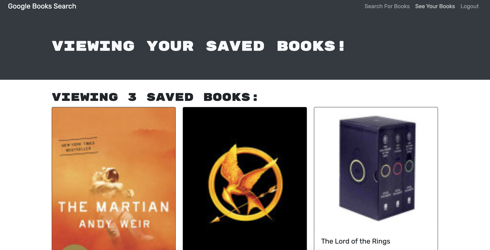

# React portfolio

## Table of Contents
### -[Links](#links)
### -[Installation](#installation)
### -[Technologies](#technologies)
### -[Questions](#questions)

## Links

Link to deployed application: https://mern-book-api.herokuapp.com/

A screenshot of the final project:

## Description
This week's challenge involved creating our first MERN-stack application! Using the Google Books API, a user is able to log into and out of the application, search for their favorite books, and save them to their own list. They should be able to delete from their list as well. If a user tries to add a book to their list while they aren't logged in, they will not be able to do so. 
  
## Installation
### Instructions for Project Installation:
Run 'npm i' to ensure all packages are installed correctly. When working in development, you can run 'npm run develop' to use localhost.
  
## Technologies
### Built With:
MERN stack--> Mongoose, Express, React, Node; also utilized the Google Books API, jsonwebtoken, apollo-server-express, and GraphQL.
  
## Questions
### Please reach out with any questions or concerns!
Github: https://github.com/mtpott

Email: mtpott23@gmail.com